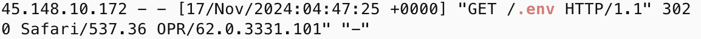
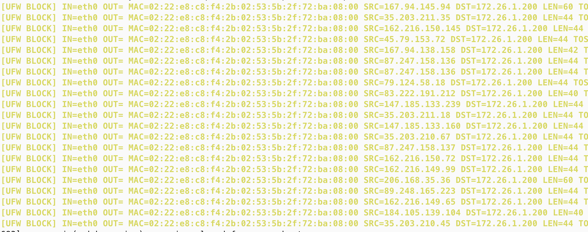
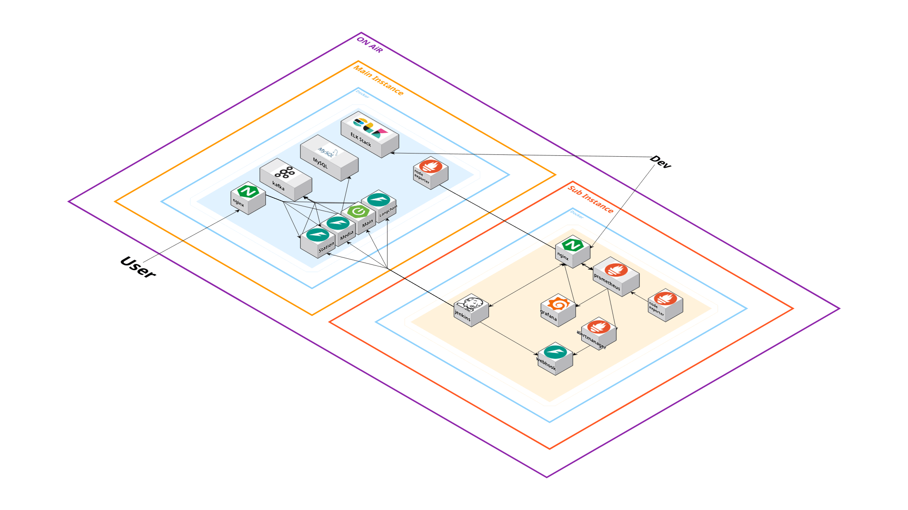

# 인프라를 끝내면서

나는 이제 커맨드창만 보면서 코딩하는 시대는 지났다고 생각했거든? 근데 한달 동안 내가 커맨드창만 보고 욕하고 있으니까 현타오더라

그래도 기본은 알아야 나중에 어디에다가 욕해야하는지 알테니까 만족스럽긴함

## 설정
0. 무조건 보안 신경 쓸 것.
  - 환경 변수 공격
  
  - 무수한 GET 요청
  
  - 도커 인젝션 (이건 진짜 내 실수긴 함)
  [관련 뉴스 기사](https://www.dailysecu.com/news/articleView.html?idxno=160587)

    아무튼, 진짜 별의 별 방식으로 공격이 들어오고, 이를 고려해서 인프라를 구성해야함

    공통, 특화 때 DB열고 있었는데, 사실 그런 짓도 해놓으면 레디스에 sh 인젝션 당하는 경우도 허다하고, DB까지 접근해서 랜섬 공격하는 것도 그냥 대문 열어놓고 있어서 그런거임

    그냥 운이 좋았던 것 뿐

1. 기본적으로 ec2가 있는 경우 Docker를 사용한다.
    
    도커는 10.27, 10.28에 올렸던것들 2개로 올릴 수 있음

2. 그냥 데스크탑에서도 도커 설정이 가능함
    
    요즘은 그냥 WSL이 잘 되어 있어서, 윈도우에서도 가능하고, 맥에서는 기본적으로 설정 없이 가능하다

## 시작

사용했던 아키텍쳐를 기준으로 설명하되, 문제가 발생할 수 있는 부분은 미리 설명함

1. 젠킨스는 권한이 많다.
- 젠킨스로 들어올 수 있다면 시스템 내부에 코드를 실행시킬 수 있다.
2. 프로메테우스와 ELK도 권한이 많다.
- 두 곳에 접근할 수 있다면, 시스템 매트릭 데이터와 시스템 로그를 모두 찾을 수 있고 민감한 데이터를 모두 찾아볼 수 있다.

그렇기 때문에 이를 모두 nginx 를 통해 배포하는 것은 위험소지가 많다.

젠킨스를 사용하기 위해서는, 로컬 환경에서만 구성하는 것이 바람직하고 그렇지 않은 경우 책임자만 들어올 수 있도록 IP제한을 걸어두는 것이 좋다.

그런데 젠킨스를 로컬 영역에 두는 경우에는, Gitlab의 webhook기능을 온전히 사용할 수 없기 때문에 일장일단이 존재한다.

같은 관점에서, 프로메테우스와 ELK또한 Nginx 를 통해 배포할 이유는 없기 때문에 젠킨스와 같이 설정하는게 옳다.

저기서 나는 추가 인스턴스의 크기가 작았기 때문에 ELK를 메인 인스턴스로 둘 수 밖에 없었고, 이를 해결하기 위해 ssh 터널링이나 포트를 제한하는 등 추가적인 조치를 실행했다.

## Docker Swarm
포팅 메뉴얼에 쓸 수 없는 내용이라 여기 씀

원래 계획은 쿠버네티스였다가, 능지가 딸려서 도커 스웜으로 선회했고, 두 인스턴스 간 통신을 위해 포트를 열어뒀는데, 당연히 포트간 연결에서 점유하고 있을 줄 알았으나 그렇지 않아 인젝션 공격이 발생했음(그래서 초기화 함ㅋㅋ)

Docker swarm은, 쿠버네티스처럼 서비스 간 오케스트레이션과 오토 스케일링을 담당하지만, 도커에서 기본적으로 제공하는 기능이기에 쿠버네티스보다 설정이 간편하다는 장점이 있다.

Docker-compose 파일을 약간만 수정하면 Docker swarm의 서비스를 구성하는 데 사용할 수 있어 설정이 진짜 간편하다.

`docker swarm init --advertise-addr <MAIN_EC2_IP>`
명령어를 사용하는 인스턴스의 IP를 넣어 도커 스웜 기능을 초기화 한다.

이 명령어를 사용하고 나면, 워커 노드를 등록할 수 있는 명령어를 받을 수 있다.

`docker swarm join --token <SWARM_JOIN_TOKEN> <MAIN_EC2_IP>:2377` 형태의 명령어가 표시되고, 이를 추가할 EC2 인스턴스에 입력한다.

2377, 4789 등 추가적인 포트를 개방해 도커 스웜 통신을 진행한다.

이 때, 포트 개방 시 IP 제한을 무조건 걸어둬야한다..

만일, 포트를 열어두지 않은 채로 명령어를 입력했더라도, 백그라운드에서 다시 시도하고 있기 때문에 이후에 포트를 열면 연결이 완료된다.

완료 후, `sudo docker node ls` 를 통해 HOSTNAME을 확인할 수 있다.

docker swarm을 활성화 하기 위해서,

`docker network create --driver overlay <my_overlay_network>`  명령어를 실행하면 overlay를 위한 네트워크가 구성되어 EC2 간 통신이 가능해진다.

- 도커 네트워크의 overlay 속성은 docker swarm 모드에서만 가능하다.

### 도커 스웜의 장점
컨테이너를 동시에 몇개씩 생성해서 이를 서비스라는 단위로 묶어 사용하기에, 한 서버의 문제가 발생해도 괜찮은 환경이 구성된다.

### 그런데 왜 포기했냐면
1. 포트 열고 닫고 iptables 구성하고 말고 하는게 너무 힘듬 (과정에서 해커도 놀러옴)
2. 워커 노드에 단독으로 설치해서 시스템을 구성하는 것을 목표로 했는데, 이 설정이 쉽게 되는게 아니었음. 메인 인스턴스 도커 내부에 있는 nginx와, 추가 인스턴스 도커 내부에 있는 jenkins가 같은 네트워크에 있음에도 인식하지 못함

결과적으로, 해킹 시도 확인하고 초기화하면서 도커 컴포즈 방식으로 회귀했고, 위의 아키텍쳐 구성도와 같은 결과물이 나옴

